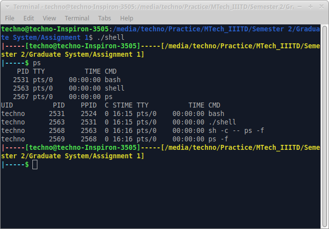

# Shell Implementation in C

## Table of Contents
1. [Introduction](#introduction)
2. [File Structure](#file-structure)
3. [Shell Components](#shell-components)
4. [How to Run the Shell](#how-to-run-the-shell)
5. [Shell Features](#shell-features)
6. [Example Usage](#example-usage)
7. [Error Handling](#error-handling)
8. [Extending Functionality](#extending-functionality)
9. [Testing the Shell](#testing-the-shell)
10. [Contributing](#contributing)
11. [License](#license)

## Introduction

This is a basic implementation of a shell in C. The shell provides a command-line interface for users to interact with the operating system. It supports basic commands such as `cd`, `ls`, `exit`, and `help`.

## File Structure

The shell implementation consists of the following files:

- **shell.c**: The main file that contains the shell loop and handles user input.
- **redir.c**: Handles redirection of input/output streams.
- **prompt.c**: Displays the shell prompt.
- **parser.c**: Parses user input into commands and arguments.
- **execute.c**: Executes commands and handles errors.
- **fact.c**: A sample program that calculates the factorial of a number.

## Shell Components

### 1. shell.c
- Contains the main shell loop that reads user input and executes commands.
- Handles the `exit` command to exit the shell.

### 2. redir.c
- Handles redirection of input/output streams using `<` and `>` symbols.
- Supports output redirection to a file.

### 3. prompt.c
- Displays the shell prompt with the current working directory and username.

### 4. parser.c
- Parses user input into commands and arguments.
- Supports quoted strings and escaped characters.

### 5. execute.c
- Executes commands using `fork` and `execvp`.
- Handles errors and displays error messages.

### 6. fact.c
- A sample program that calculates the factorial of a number.
- Can be executed from the shell using the `./fact` command.

## How to Run the Shell

1. **Compile the shell files** using `gcc`:

    ```bash
    gcc -o shell shell.c redir.c prompt.c parser.c execute.c
    ```

2. **Run the shell**:

    ```bash
    ./shell
    ```

3. Type `exit` to exit the shell.

## Shell Features

- Supports basic commands: `cd`, `ls`, `exit`, `help`
- Handles redirection of input/output streams using `<` and `>` symbols
- Displays shell prompt with the current working directory and username
- Parses user input into commands and arguments
- Executes commands using `fork` and `execvp`

## Example Usage

1. **Run the shell**:

    ```bash
    ./shell
    ```

2. **Type `ls`** to list files in the current directory:

    ```bash
    |-----[user@hostname]-----[/path_of_current_directory]
    |-----$ ls
    Makefile  README  execute.c  execute.h  fact  fact.c  parser.c  parser.h  prompt.c  prompt.h  redir.c  redir.h  shell.c  shell.h
    ```

3. **Type `cd`** to change the current directory:

    ```bash
    |-----[user@hostname]-----[/path_of_current_directory]
    |-----$ cd /path_new_directory
    |-----[user@hostname]-----[/path_new_directory]
    ```

4. **Type `exit`** to exit the shell:

    ```bash
    |-----[user@hostname]-----[/path_of_current_directory]
    |-----$ exit
    ```

5. **Type `ps`** to show process tree in the shell:

    ```bash
    |-----[user@hostname]-----[/path_of_current_directory]
    |-----$ ps
    ```
    
    
    

## Error Handling

- The shell provides error messages for invalid commands.
- If a command fails to execute, an appropriate error message is displayed.

## Extending Functionality

- To add new commands, modify the `execute.c` file to include additional command handling.
- Implement new features by creating new source files and integrating them into the main shell loop.

## Testing the Shell

- Test the shell by executing various commands and checking for expected outputs.
- Ensure that redirection works correctly by testing input and output redirection.

## Contributing

- Contributions are welcome! Please fork the repository and submit a pull request with your changes.
- Ensure that your code follows the existing style and includes appropriate documentation.

## License

This project is licensed under the MIT License. See the `LICENSE` file for more details.
