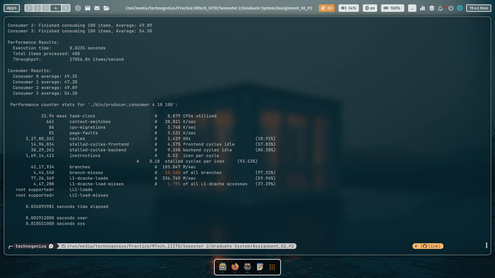
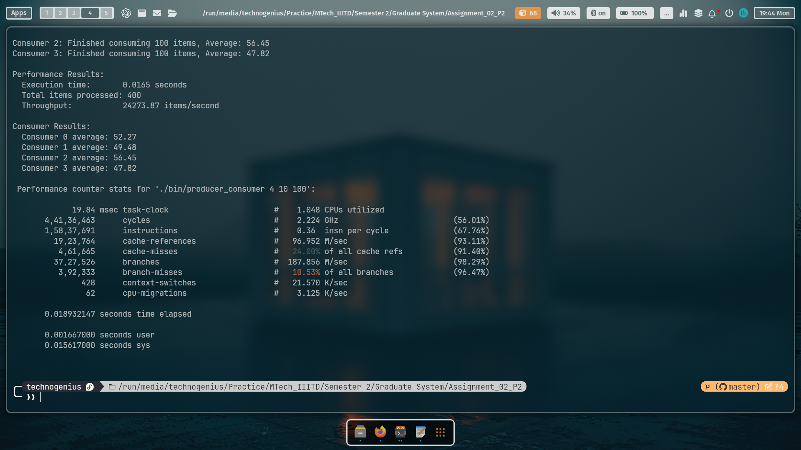
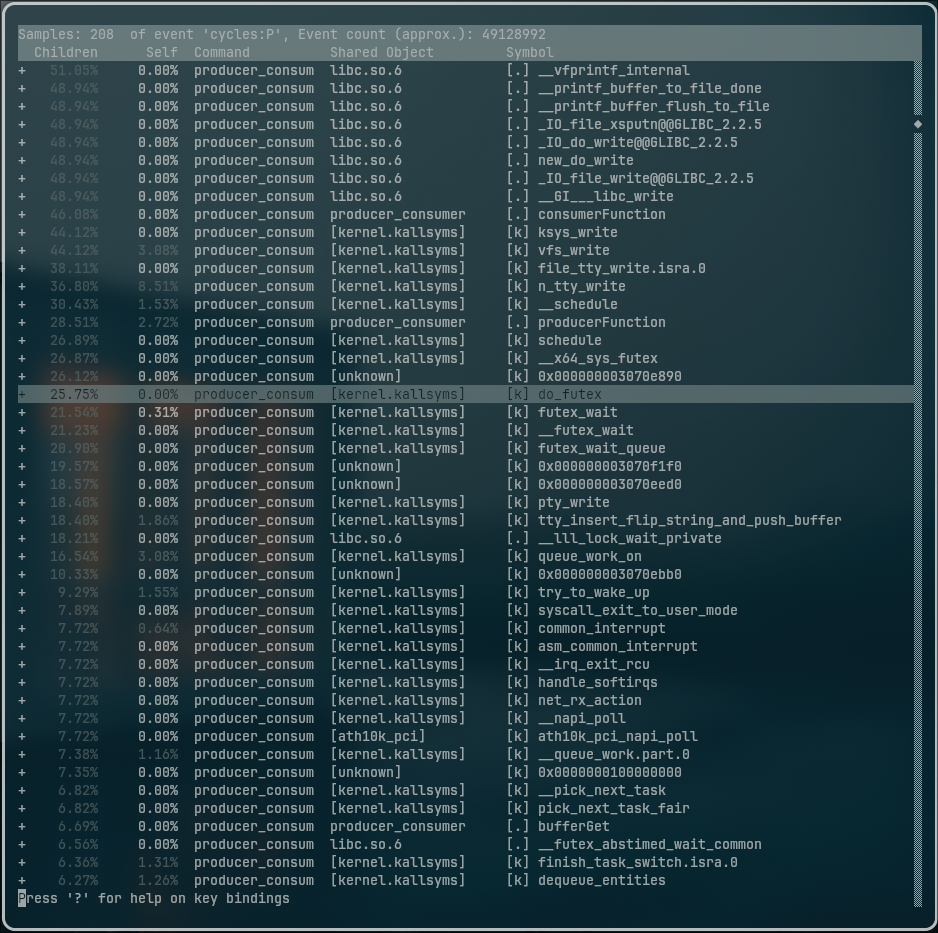
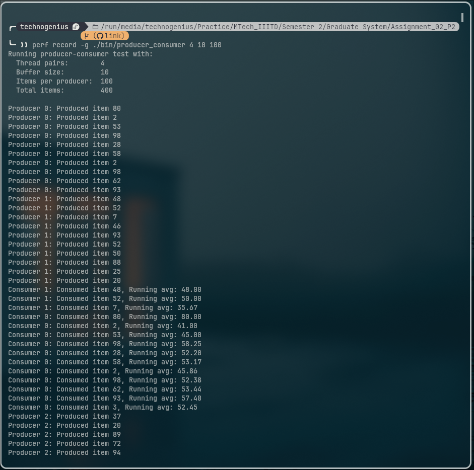
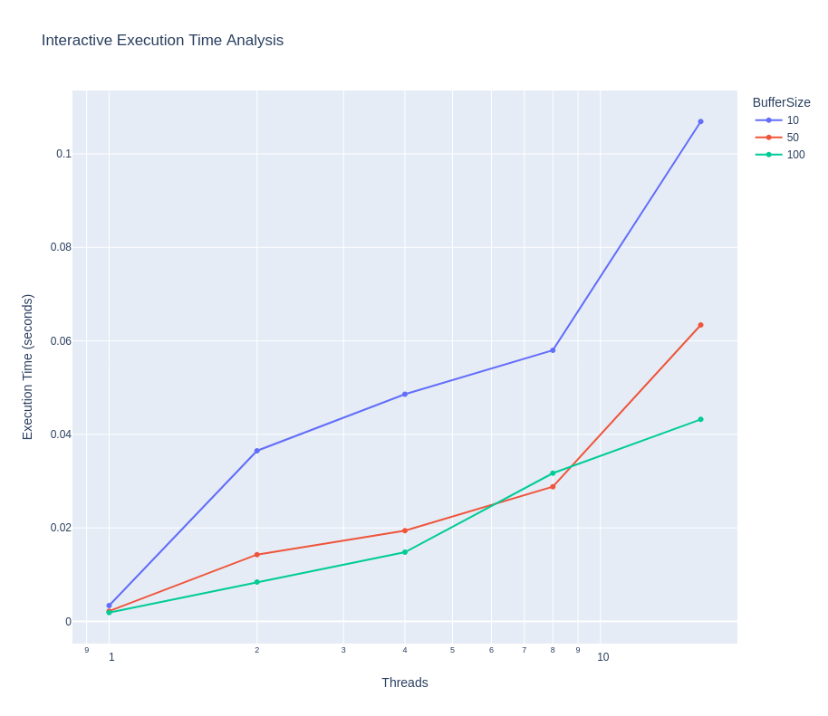
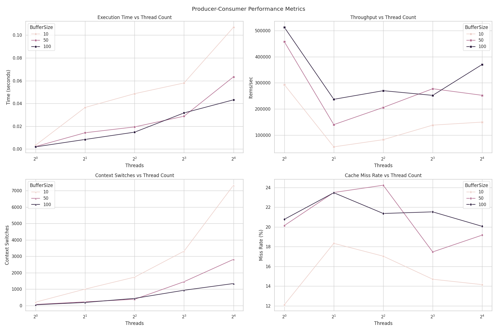

# Pipeline Program with Producer-Consumer Threads

## Overview
This document provides a comprehensive analysis of the implementation and performance evaluation of a multithreaded producer-consumer pipeline program. The objective of this assignment is to explore the efficiency of multithreading in data processing and to analyze the performance using the `perf` tool.

## Objectives
- Implement a producer-consumer pipeline using threads.
- Analyze the performance of the program under various configurations.
- Utilize the `perf` tool to gather performance metrics and insights.

## Implementation Details

### Producer-Consumer Model
- **Producer Threads:**
  - Responsible for generating data and placing it into a shared buffer.
  - Example: Each producer thread populates 100 random numbers into a shared array.
  - Utilizes condition variables to signal consumers when new data is available.

- **Consumer Threads:**
  - Retrieve data from the shared buffer and process it.
  - Example: Each consumer thread computes the average of the numbers retrieved from the buffer.
  - Uses mutexes to ensure exclusive access to the shared buffer during data retrieval.

### Synchronization Mechanisms
- **Mutexes:** 
  - Used to protect shared resources and prevent race conditions.
  
- **Condition Variables:**
  - Employed to signal consumer threads when data is available in the buffer, allowing for efficient waiting and notification.

## Performance Analysis

### Metrics Analyzed
- **Execution Time:**
  - Measured the total time taken for the producer-consumer pipeline to complete its operations.

- **Throughput:**
  - Calculated as the number of data items processed per second, providing insight into the efficiency of the pipeline.

- **Context Switches:**
  - Monitored the number of context switches occurring during execution to evaluate thread management efficiency.

- **Cache Behavior:**
  - Analyzed cache hits and misses to understand memory access patterns and their impact on performance.

 

 

### Tools Used
- **`perf` Tool:**
  - Utilized for profiling the program and gathering detailed performance metrics.
  - Key metrics analyzed include CPU usage, memory bandwidth, cache references, cache misses, and I/O wait time.

## Results

### Execution Time
- The execution time was recorded for various configurations of producer and consumer threads. The results indicated that optimal performance was achieved with a specific number of threads.

### Throughput
- The throughput was measured and plotted against the number of threads. The results showed a clear trend of increasing throughput with the number of threads, up to a certain point.

### Context Switches
- The number of context switches was recorded, revealing that excessive context switching negatively impacted performance as the number of threads increased.

### Cache Behavior
- Cache metrics were analyzed, showing a correlation between cache hits and overall execution time. Programs with better cache performance exhibited lower execution times.

 

 

 

## Graphs and Visualizations
- Graphs illustrating the performance metrics (execution time, throughput, context switches) were generated using the `matplotlib` library.
- Comparative analysis of different configurations was visualized, highlighting the optimal number of threads for maximum throughput.

 

## Observations
- The performance of the producer-consumer pipeline improved with an optimal number of threads, demonstrating the benefits of multithreading.
- Beyond a certain threshold, increasing the number of threads led to diminishing returns due to increased context switching and contention for shared resources.
- The analysis identified potential bottlenecks in the synchronization mechanisms, suggesting areas for future optimization.

## Conclusion
The implementation of the producer-consumer pipeline program successfully demonstrated the advantages of multithreading in data processing. The performance analysis using the `perf` tool provided valuable insights into the program's behavior under different configurations, allowing for the identification of optimization opportunities.