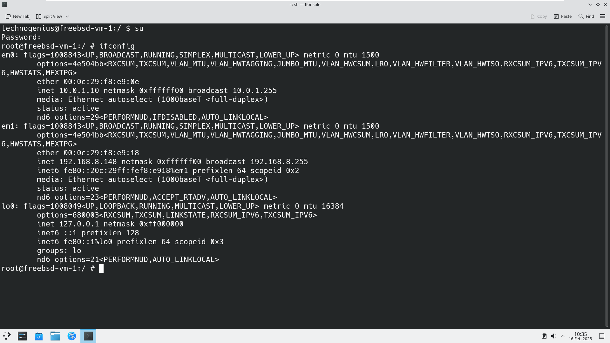
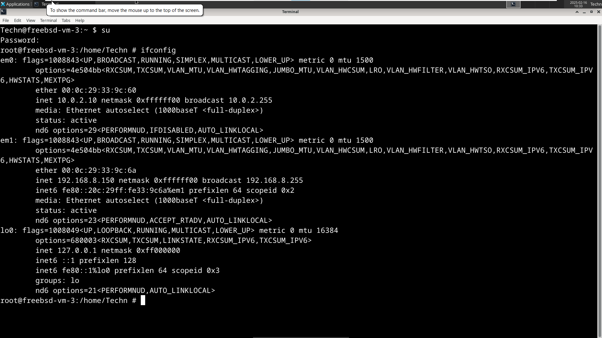
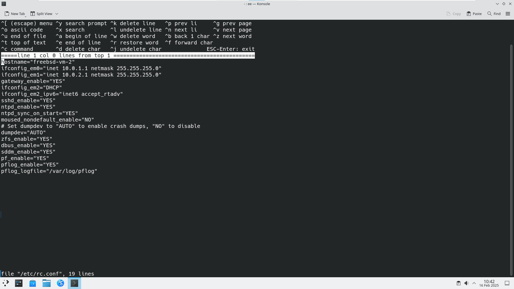
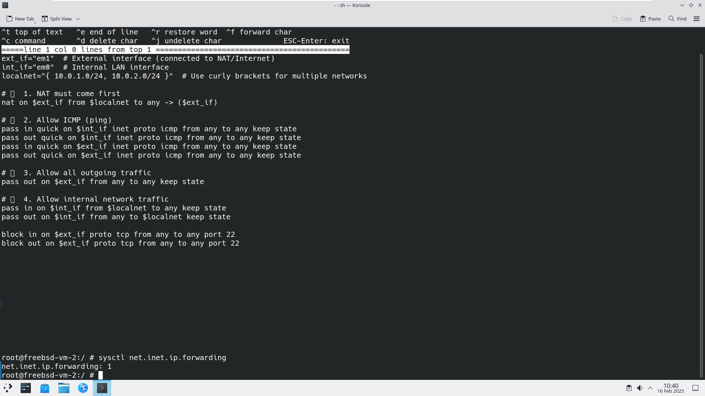
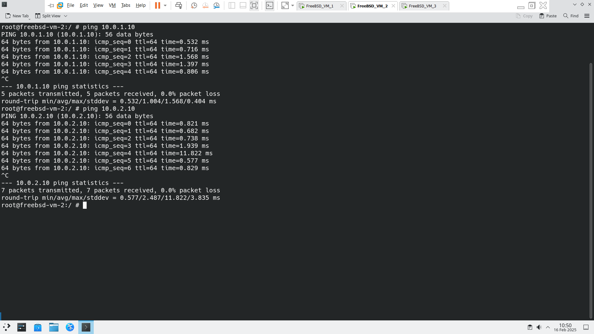
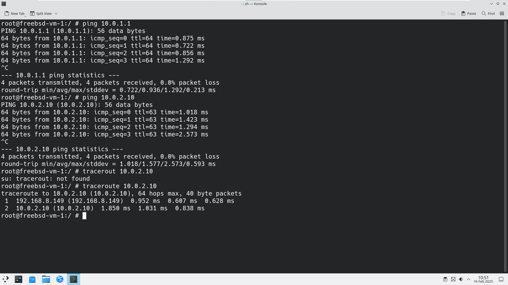
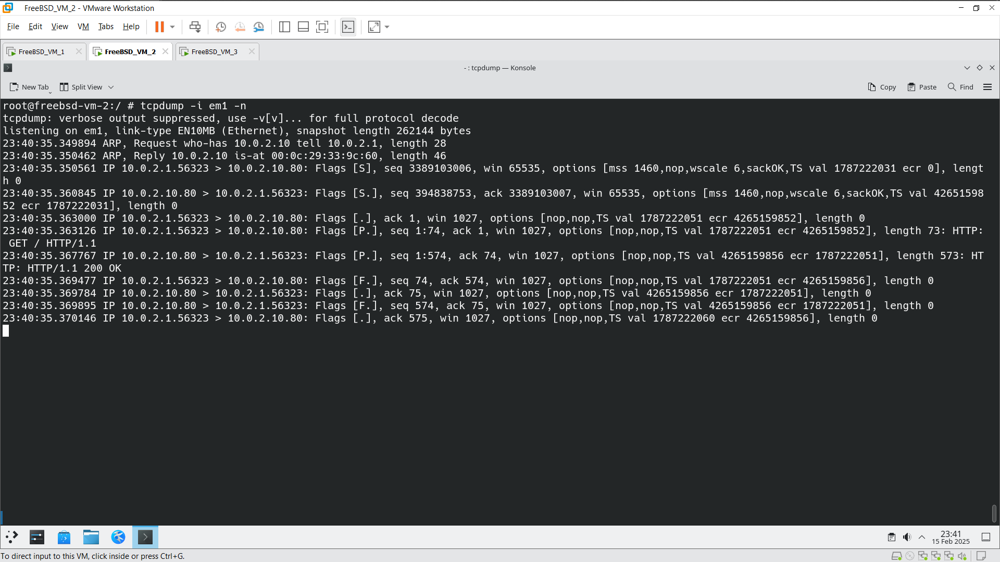
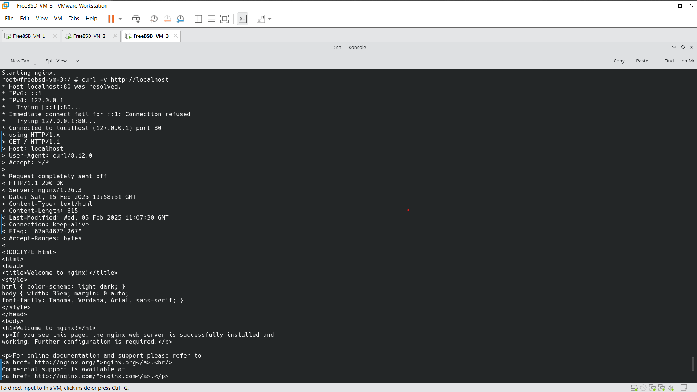
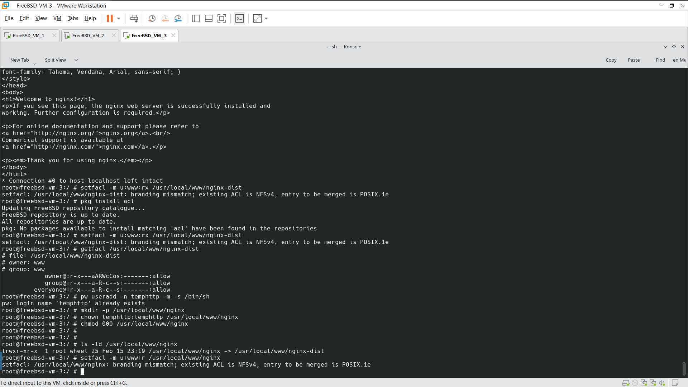
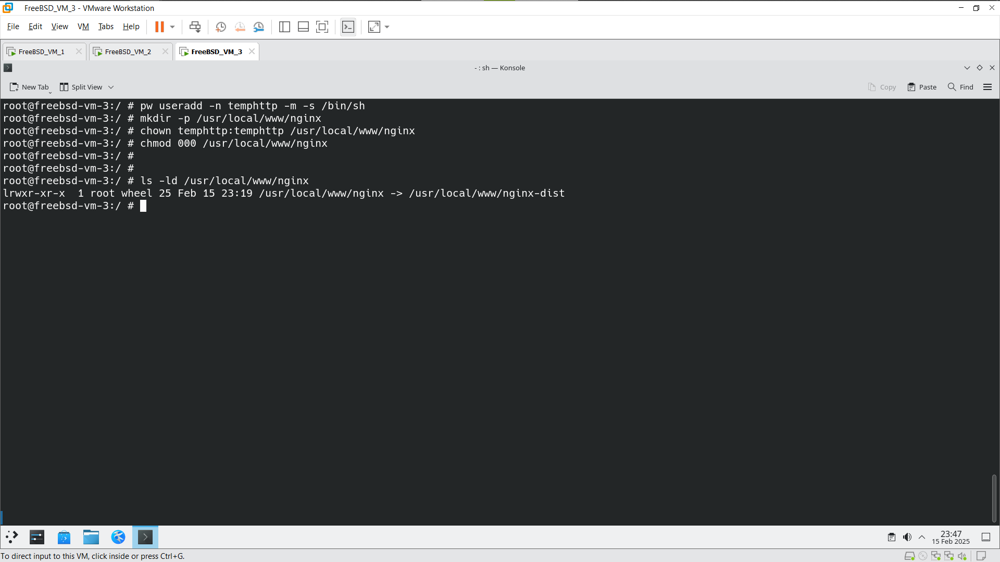

# FreeBSD Network Security Exercise  
**Networks and Systems Security II (CSE354/554)**  

---

## Table of Contents  
1. [Lab Overview](#lab-overview)  
2. [Virtual Machine Setup](#virtual-machine-setup)  
   - [VM Specifications](#vm-specifications)  
   - [Network Topology](#network-topology)  
3. [Task 1: Firewall & NAT Configuration](#task-1-firewall--nat-configuration)  
   - [Step 1: Assign Static IP Addresses](#step-1-assign-static-ip-addresses)  
   - [Step 2: Enable IP Forwarding on VM2](#step-2-enable-ip-forwarding-on-vm2)  
   - [Step 3: Configure PF Firewall Rules](#step-3-configure-pf-firewall-rules)  
   - [Step 4: Test NAT & Connectivity](#step-4-test-nat--connectivity)  
4. [Task 2: Web Server & ACL Configuration](#task-2-web-server--acl-configuration)  
   - [Step 1: Install & Configure Nginx](#step-1-install--configure-nginx)  
   - [Step 2: Set File Permissions with `setuid`](#step-2-set-file-permissions-with-setuid)  
   - [Step 3: Apply Linux ACLs](#step-3-apply-linux-acls)  
5. [Validation & Screenshots](#validation--screenshots)  
6. [Troubleshooting](#troubleshooting)  
7. [References](#references)  

---

## Lab Overview  
This lab configures a **FreeBSD-based firewall (VM2)** to perform **bidirectional NAT** and traffic filtering using `pf`, while **VM3** hosts a web server with strict file permissions enforced by **ACLs**. Key objectives:  
1. Isolate VM1 (client) and VM3 (server) into separate subnets.  
2. Route traffic through VM2 (firewall) with NAT.  
3. Restrict VM3’s web server to ports 80/443.  
4. Use Linux ACLs to control access to the web directory.  

---

## Virtual Machine Setup  

### VM Specifications  
| VM  | Role              | OS           | RAM  | CPU  | Interfaces       |  
|-----|-------------------|--------------|------|------|------------------|  
| VM1 | Client            | FreeBSD 14   | 1GB  | 1    | `iface1` # em0 (LAN)   |  
| VM2 | Firewall/NAT      | FreeBSD 14   | 1GB  | 1    | `iface1` # em0, `iface2` # em1 |  
| VM3 | Web Server        | Linux/FreeBSD| 1GB  | 1    | `iface2` # em1, `em1` (WAN) |  

### Network Topology  
```
[VM1: 10.0.1.10]  
    │  
    ├── (iface1: # em0 10.0.1.1)  
    │  
[VM2: Firewall/NAT]  
    │  
    ├── (iface2: # em1 10.0.2.1)  
        │  
        └── [VM3: 10.0.2.10]  
               │  
               └── [External: 192.168.8.150]  
```  
- **Subnet 1**: `10.0.1.0/24` (VM1 ↔ VM2)  
- **Subnet 2**: `10.0.2.0/24` (VM2 ↔ VM3)  
- **External**: `192.168.8.0/24` (VM3’s internet access)  

---

## Task 1: Firewall & NAT Configuration  

### Step 1: Assign Static IP Addresses  
**On VM1 (Client):**  
```bash  
ifconfig iface1  # em0inet 10.0.1.10 netmask 255.255.255.0  
route add default 10.0.1.1  # Set VM2 as gateway  
```  

**On VM2 (Firewall):**  
```bash  
ifconfig iface1  # em0inet 10.0.1.1 netmask 255.255.255.0  
ifconfig iface2  # em1inet 10.0.2.1 netmask 255.255.255.0  
```  

**On VM3 (Server):**  
```bash  
ifconfig iface2  # em1inet 10.0.2.10 netmask 255.255.255.0  
ifconfig em1 inet 192.168.8.150 netmask 255.255.255.0  
route add default 192.168.8.1  # External gateway  
```  




### Step 2: Enable IP Forwarding on VM2  
Enable packet forwarding to allow VM2 to route traffic:  
```bash  
sysctl net.inet.ip.forwarding=1  
echo 'net.inet.ip.forwarding=1' >> /etc/sysctl.conf  # Persist on reboot  
```  
**Verify:**  
```bash  
sysctl net.inet.ip.forwarding  # Should return "1"  
```  



### Step 3: Configure PF Firewall Rules  
Edit `/etc/pf.conf` on VM2:  
```bash  
# Define interfaces  
ext_if = "iface2" # em1  
int_if = "iface1" # em0  
localnet = "{ 10.0.1.0/24, 10.0.2.0/24 }"  

# NAT Configuration  
nat on $ext_if from $localnet to any -> ($ext_if)  # Outbound NAT  
nat on $int_if from any to $ext_if -> ($int_if)    # Inbound NAT  

# Traffic Rules  
block all  # Default deny  

# Allow internal traffic  
pass in quick on $int_if from $localnet to any  
pass out quick on $ext_if from any to $localnet  

# Allow HTTP/HTTPS from external networks  
pass in on $ext_if proto tcp from any to any port { 80, 443 }  
pass out on $ext_if proto tcp from any to any port { 80, 443 }  

# Block SSH (Port 22)  
block in quick on $ext_if proto tcp from any to any port 22  
```  

**Activate Rules:**  
```bash  
pfctl -f /etc/pf.conf  # Load rules  
pfctl -s rules  # Verify rules (screenshot this!)  
```  

### Step 4: Test NAT & Connectivity  
**From VM1:**  
```bash  
ping 10.0.2.10  # Should succeed  
traceroute 10.0.2.10  # Traffic must route through VM2 (10.0.1.1 → 10.0.2.1)  
```  



**Capture NAT Traffic:**  
On VM2, run:  
```bash  
tcpdump -i iface2  # em1-n port 80  # Observe NAT translation  
```  
- **Expected Result**: Requests from VM1 (10.0.1.10) appear as coming from VM2 (10.0.2.1).  

---


## Task 2: Web Server & ACL Configuration  

### Step 1: Install & Configure Nginx  
**On VM3:**  
```bash  
# Install Nginx (Linux example)  
sudo apt update && sudo apt install nginx  
sudo systemctl start nginx  

# Create web directory  
sudo mkdir -p /usr/local/www/nginx   
```  



### Step 2: Set File Permissions with `setuid`  
**Create User `templttp`:**  
```bash  
sudo useradd templttp  
sudo chown -R templttp:templttp /usr/local/www/nginx  
sudo chmod 0700 /usr/local/www/nginx  # Deny all except owner  
```  


**Attempt Access via Nginx:**  
```bash  
curl http://10.0.2.10/nginx  # Should fail (403 Forbidden)  
```  

### Step 3: Apply Linux ACLs  
Grant read access to the `www-data` user/group (Nginx):  
```bash  
sudo setfacl -m u:www-data:r-x /usr/local/www/nginx  
sudo getfacl /usr/local/www/nginx  # Verify ACLs (screenshot this!)  
```  
**Retest Access:**  
```bash  
curl http://10.0.2.10/nginx  # Should now succeed  
```  

---


## Validation & Screenshots  
Include the following in your report:  
1. **VM2’s Routing Table**: `netstat -rn`  
2. **PF Rules**: `pfctl -s rules`  
3. **NAT Verification**: `tcpdump` output showing translated IPs.  
4. **ACL Configuration**: `getfacl /usr/local/www/nginx`  

---

## Troubleshooting  
| Issue                          | Solution                                  |  
|--------------------------------|-------------------------------------------|  
| PF not loading                 | `kldload pf; service pf restart`          |  
| VM3 cannot reach the internet  | Verify default route: `route -n get default` |  
| Connection timeout on port 80  | Check firewall rules: `pfctl -s rules`    |  

---

## References  
1. [FreeBSD PF Handbook](https://docs.freebsd.org/en/books/handbook/firewalls/)  
2. [Linux ACL Guide](https://linuxconfig.org/how-to-manage-acls-on-linux)  

--- 