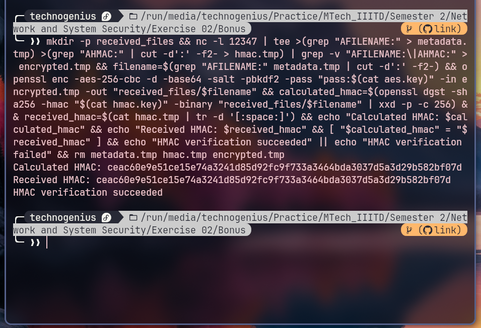

# AES-enabled SCP Implementation with HMAC Verification

## Introduction

This report explains how to build a secure file transfer system using OpenSSL and netcat. The system encrypts files with AES and verifies their integrity with HMAC, similar to the secure copy (scp) command but using symmetric encryption instead of SSH.

## Setup and Requirements

Before starting, make sure you have the following tools installed:
- OpenSSL (for encryption and HMAC generation)
- netcat (for network communication)
- xxd (for binary to hex conversion)
- tcpdump or Wireshark (for capturing network traffic)

## Step 1: Key Generation

First, we need to create encryption and authentication keys:

```bash
openssl rand -hex 32 > aes.key
openssl rand -hex 32 > hmac.key
chmod 600 aes.key hmac.key
```

Explanation:
- `openssl rand -hex 32`: Generates 32 bytes (256 bits) of random data in hexadecimal format
- `> aes.key`: Saves the output to a file named aes.key
- `chmod 600`: Sets permissions so only the owner can read/write the key files


## Step 2: Create a Test File

If you don't have a file to transfer, create a simple test file:

```bash
echo "Hello, This is Bhargav..." > hello.txt
```

This creates a file named hello.txt with a simple text message inside.


## Step 3: Start Network Capture (Optional)

To show the encrypted traffic for your report, open a separate terminal and run:

```bash
sudo tcpdump -i lo -w aes_transfer.pcap port 12347
```

Explanation:
- `sudo`: Run with administrator privileges
- `tcpdump`: Command to capture network packets
- `-i lo`: Capture on loopback interface (for local testing)
- `-w aes_transfer.pcap`: Save the capture to a file
- `port 12347`: Only capture traffic on port 12347


## Step 4: Start the Receiver

Now set up the receiver side with this one-liner:

```bash
mkdir -p received_files && nc -l 12347 | tee >(grep "AFILENAME:" > metadata.tmp) >(grep "AHMAC:" | cut -d':' -f2- > hmac.tmp) | grep -v "AFILENAME:\|AHMAC:" > encrypted.tmp && filename=$(grep "AFILENAME:" metadata.tmp | cut -d':' -f2-) && openssl enc -aes-256-cbc -d -base64 -salt -pbkdf2 -pass "pass:$(cat aes.key)" -in encrypted.tmp -out "received_files/$filename" && calculated_hmac=$(openssl dgst -sha256 -hmac "$(cat hmac.key)" -binary "received_files/$filename" | xxd -p -c 256) && received_hmac=$(cat hmac.tmp | tr -d '[:space:]') && echo "Calculated HMAC: $calculated_hmac" && echo "Received HMAC: $received_hmac" && [ "$calculated_hmac" = "$received_hmac" ] && echo "HMAC verification succeeded" || echo "HMAC verification failed" && rm metadata.tmp hmac.tmp encrypted.tmp
```

Let's break down this long command:

1. `mkdir -p received_files`
   - Creates a directory called "received_files" if it doesn't already exist
   - The `-p` flag prevents errors if the directory already exists

2. `nc -l 12347 | ...`
   - Starts netcat in listen mode on port 12347
   - This waits for an incoming connection from the sender

3. `tee >(grep "AFILENAME:" > metadata.tmp) >(grep "AHMAC:" | cut -d':' -f2- > hmac.tmp)`
   - `tee` takes the incoming data and splits it into multiple streams
   - The `>( )` syntax is called process substitution (a Bash feature)
   - First process: extracts lines with "AFILENAME:" and saves them to metadata.tmp
   - Second process: extracts lines with "AHMAC:", cuts everything after the colon, and saves to hmac.tmp

4. `grep -v "AFILENAME:\|AHMAC:" > encrypted.tmp`
   - Filters out the lines containing "AFILENAME:" or "AHMAC:"
   - The `-v` flag means "invert match" (exclude matches)
   - The `\|` is a logical OR in grep patterns
   - Saves the remaining content (the encrypted file) to encrypted.tmp

5. `filename=$(grep "AFILENAME:" metadata.tmp | cut -d':' -f2-)`
   - Extracts the actual filename from the metadata.tmp file
   - Looks for lines containing "AFILENAME:"
   - Uses `cut` to get everything after the colon
   - Stores the result in the `filename` variable

6. `openssl enc -aes-256-cbc -d -base64 -salt -pbkdf2 -pass "pass:$(cat aes.key)" -in encrypted.tmp -out "received_files/$filename"`
   - Decrypts the encrypted file using OpenSSL
   - `-aes-256-cbc`: Uses AES-256 encryption in CBC mode
   - `-d`: Specifies decryption mode
   - `-base64`: Specifies the input is Base64 encoded
   - `-salt`: Uses a salt for the key derivation
   - `-pbkdf2`: Uses PBKDF2 for key derivation
   - `-pass "pass:$(cat aes.key)"`: Uses the content of aes.key file as the password
   - `-in encrypted.tmp`: Reads from the encrypted.tmp file
   - `-out "received_files/$filename"`: Saves the decrypted file to the received_files directory with its original name

7. `calculated_hmac=$(openssl dgst -sha256 -hmac "$(cat hmac.key)" -binary "received_files/$filename" | xxd -p -c 256)`
   - Calculates an HMAC for the decrypted file
   - `openssl dgst -sha256`: Uses SHA-256 for the digest
   - `-hmac "$(cat hmac.key)"`: Uses the content of hmac.key as the HMAC key
   - `-binary`: Outputs in binary format
   - `"received_files/$filename"`: The file to calculate the HMAC for
   - `xxd -p -c 256`: Converts the binary output to a hex string on a single line
   - Stores the result in the `calculated_hmac` variable

8. `received_hmac=$(cat hmac.tmp | tr -d '[:space:]')`
   - Reads the received HMAC from hmac.tmp
   - `tr -d '[:space:]'`: Removes all whitespace characters
   - Stores the result in the `received_hmac` variable

9. `echo "Calculated HMAC: $calculated_hmac" && echo "Received HMAC: $received_hmac"`
   - Displays both HMACs for comparison

10. `[ "$calculated_hmac" = "$received_hmac" ] && echo "HMAC verification succeeded" || echo "HMAC verification failed"`
    - Compares the two HMACs
    - `[ "$calculated_hmac" = "$received_hmac" ]`: Tests if they are equal
    - If equal, prints "HMAC verification succeeded"
    - If not equal, prints "HMAC verification failed"

11. `rm metadata.tmp hmac.tmp encrypted.tmp`
    - Cleans up the temporary files




## Step 5: Send the File

In another terminal, run the sender command:

```bash
echo -n "Enter path to file to send: " && read filepath && filename=$(basename "$filepath") && echo "Sending file: $filename" && hmac=$(openssl dgst -sha256 -hmac "$(cat hmac.key)" -binary "$filepath" | xxd -p -c 256) && echo "Generated HMAC: $hmac" && { echo "AFILENAME:$filename"; echo "AHMAC:$hmac"; openssl enc -aes-256-cbc -base64 -salt -pbkdf2 -pass "pass:$(cat aes.key)" -in "$filepath"; } | nc localhost 12347 && echo "File transfer complete"
```

Breaking down this command:

1. `echo -n "Enter path to file to send: " && read filepath`
   - Prompts the user for a file path
   - `-n` prevents a newline after the prompt
   - Stores the input in the `filepath` variable

2. `filename=$(basename "$filepath")`
   - Extracts just the filename from the full path
   - For example, if filepath is "/home/user/documents/file.txt", this extracts "file.txt"

3. `echo "Sending file: $filename"`
   - Displays which file is being sent

4. `hmac=$(openssl dgst -sha256 -hmac "$(cat hmac.key)" -binary "$filepath" | xxd -p -c 256)`
   - Calculates an HMAC for the file
   - Similar to the receiver's calculation, but operating on the original file
   - Uses the content of hmac.key as the HMAC key
   - Stores the hex string in the `hmac` variable

5. `echo "Generated HMAC: $hmac"`
   - Displays the generated HMAC

6. `{ echo "AFILENAME:$filename"; echo "AHMAC:$hmac"; openssl enc -aes-256-cbc -base64 -salt -pbkdf2 -pass "pass:$(cat aes.key)" -in "$filepath"; } | nc localhost 12347`
   - Uses `{ }` for command grouping to send multiple outputs as a single stream
   - First sends the filename with "AFILENAME:" prefix
   - Then sends the HMAC with "AHMAC:" prefix
   - Then encrypts the file using AES-256-CBC and sends the encrypted content
   - `-base64`: Encodes the output in Base64 format
   - `-salt`: Adds a salt to the encryption
   - `-pbkdf2`: Uses PBKDF2 for key derivation
   - `-pass "pass:$(cat aes.key)"`: Uses the content of aes.key as the password
   - Pipes everything to `nc localhost 12347` to send to the receiver on port 12347
   - If transferring to a different computer, replace "localhost" with the receiver's IP address

7. `echo "File transfer complete"`
   - Displays a completion message


When prompted, enter the path to your file (e.g., ./hello.txt)


## Step 6: Verify File Reception

After sending, the receiver should show:
- The HMAC calculation
- Verification success message
- The file should be in the received_files directory

Check the received file:
```bash
cat received_files/hello.txt
```


## Step 7: Analyze Network Traffic

Stop the tcpdump capture by pressing Ctrl+C in that terminal. Now analyze the captured traffic:

```bash
tcpdump -r aes_transfer.pcap -A
```

You should see that the data is encrypted and cannot be read directly.


## Detailed Explanation of Key Commands

### OpenSSL Commands

1. **Key Generation**:
   ```bash
   openssl rand -hex 32
   ```
   This creates a random 256-bit key (32 bytes) in hexadecimal format. Strong random keys are essential for secure encryption.

2. **HMAC Generation**:
   ```bash
   openssl dgst -sha256 -hmac "$(cat hmac.key)" -binary "$filepath" | xxd -p -c 256
   ```
   - `dgst -sha256`: Uses SHA-256 hash algorithm
   - `-hmac "$(cat hmac.key)"`: Uses the HMAC key for authentication
   - `-binary`: Outputs in binary format
   - `xxd -p -c 256`: Converts binary to hexadecimal, all on one line

3. **File Encryption**:
   ```bash
   openssl enc -aes-256-cbc -base64 -salt -pbkdf2 -pass "pass:$(cat aes.key)" -in "$filepath"
   ```
   - `enc -aes-256-cbc`: Encrypts using AES-256 in CBC mode
   - `-base64`: Outputs in base64 format for safe text transmission
   - `-salt`: Adds random data to the password
   - `-pbkdf2`: Uses Password-Based Key Derivation Function 2
   - `-pass "pass:$(cat aes.key)"`: Uses the AES key file

4. **File Decryption**:
   ```bash
   openssl enc -aes-256-cbc -d -base64 -salt -pbkdf2 -pass "pass:$(cat aes.key)" -in encrypted.tmp -out "received_files/$filename"
   ```
   - `-d`: Specifies decryption mode
   - Other options are the same as encryption, but in reverse

### Netcat Commands

1. **Sender**:
   ```bash
   nc localhost 12347
   ```
   - Connects to the local machine on port 12347
   
2. **Receiver**:
   ```bash
   nc -l 12347
   ```
   - `-l`: Listens for connections on port 12347

## Security Analysis

This implementation provides:

1. **Confidentiality**: AES-256 encryption ensures that only someone with the key can read the file contents.

2. **Integrity**: HMAC-SHA256 verification ensures the file wasn't modified during transfer.

3. **Authentication**: The shared HMAC key verifies that the sender is authorized.

Unlike traditional SCP which uses SSH (asymmetric encryption), this implementation uses symmetric encryption where both sides must have the same keys.

## Conclusion

This implementation successfully creates an AES-enabled secure copy tool with HMAC verification. It works by:
1. Generating secure random keys
2. Calculating HMAC for integrity verification
3. Encrypting the file with AES-256
4. Transferring the encrypted data over the network
5. Decrypting and verifying the received file

While traditional SCP uses SSH for security, this implementation shows how to achieve similar security using symmetric encryption with AES and HMAC verification.