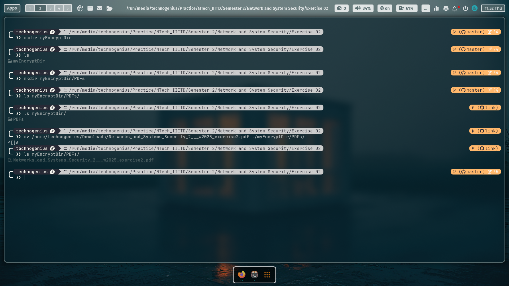
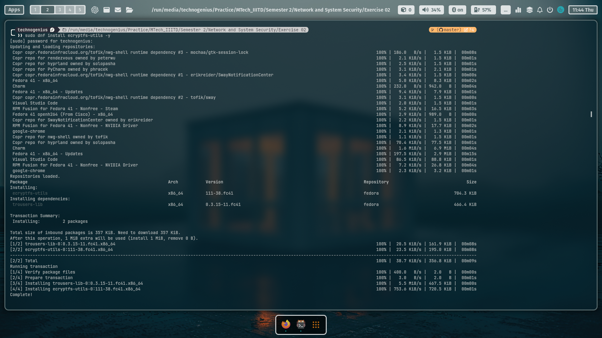
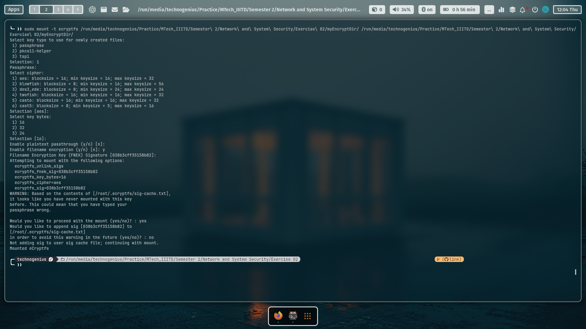
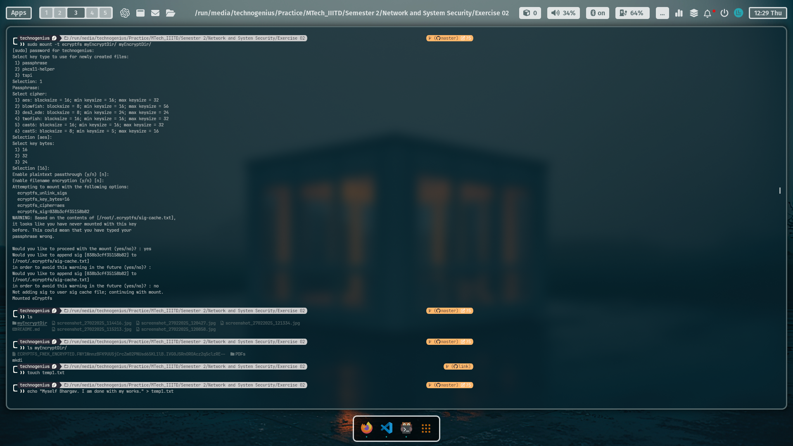
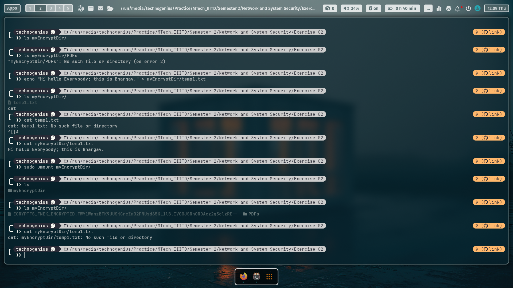
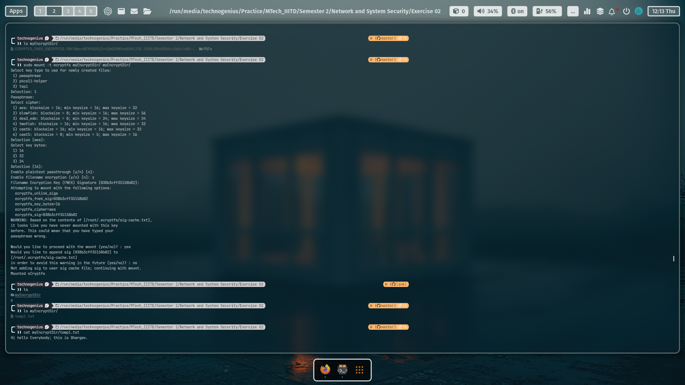
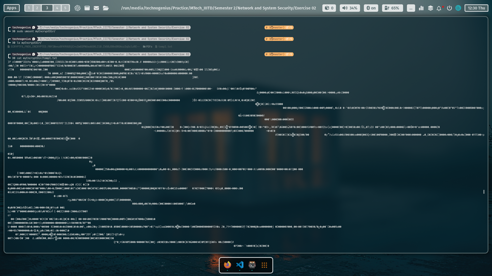

# **Report: Directory Encryption using eCryptfs**  

---
---

### **Introduction** 

In this exercise, I learned how to use **eCryptfs**, a powerful tool for encrypting files and folders on Linux systems. Encryption is important because it protects your data, ensuring that only people with the correct password can access it. This report will guide you through the following steps:  
1. Installing eCryptfs.  
2. Creating and mounting an encrypted directory.  
3. Encrypting and decrypting files.  
4. Validating the encryption process.  

Each step is explained in clear, easy-to-understand language, making it accessible for beginners. Additionally, advanced details are provided for those who want to dive deeper into the topic.

- For this exercise, here i am using Fedora Linux Distro.

---


---
---

### **Step 1: Install eCryptfs**  
**Command:**  
```bash
sudo dnf update && sudo dnf install ecryptfs-utils -y
```  
**What This Does:**  
- `sudo dnf update`: Updates the list of software packages on your system.  
- `sudo dnf install ecryptfs-utils -y`: Installs the `ecryptfs-utils` package, which includes tools for encryption. The `-y` flag automatically says "yes" to the installation.

> 

---
---

### **Step 2: Create an Encrypted Directory**  
**Command:**  
```bash
mkdir /run/media/technogenius/Practice/MTech_IIITD/Semester\ 2/Network\ and\ System\ Security/Exercise\ 02/myEncryptDir
```  
**What This Does:**  
- Creates a new folder named `myEncryptDir` in your home directory (`/run/media/technogenius/Practice/MTech_IIITD/Semester\ 2/Network\ and\ System\ Security/Exercise\ 02`).  
- This folder will store your encrypted files.  

**Why This is Important:**  
You need a dedicated folder to act as the "container" for encrypted files.  

---
---

### **Step 3: Mount the Directory with eCryptfs**  
**Command:**  
```bash
sudo mount -t ecryptfs /run/media/technogenius/Practice/MTech_IIITD/Semester\ 2/Network\ and\ System\ Security/Exercise\ 02/myEncryptDir /run/media/technogenius/Practice/MTech_IIITD/Semester\ 2/Network\ and\ System\ Security/Exercise\ 02/myEncryptDir
```  
**Interactive Prompts:**  
1. **Passphrase:** Enter your name (or any password you want to use).  
2. **Cipher:** Press `Enter` to use `aes` (default encryption method).  
3. **Key Bytes:** Press `Enter` for `16` (default key size).  
4. **Enable Plaintext Passthrough:** Type `n` (default).  
5. **Enable Filename Encryption:** Type `n` (default).  
6. **Add Signature to Cache:** Type `y` (default).

> 
> > For **Enable Filename Encryption:** Type `y`.

---

> 
> > For **Enable Filename Encryption:** Type `n`.

**What This Does:**  
- Mounts the `myEncryptDir` folder as an encrypted filesystem.  
- Any file you add to this folder will be automatically encrypted.  

**Why This is Important:**  
Mounting the folder enables encryption. Without this step, files in the folder will not be encrypted.  

---

### **Step 4: Create a Temporary File with Plaintext**  
**Command:**  
```bash
echo "Hi everybody; This is Bhargav." > myEncryptDir/temp1
cat myEncryptDir/temp1
```  
**Output:**  
```
Hi everybody; this is Bhargav.
```  
**What This Does:**  
- Creates a file named `temp1` in the encrypted folder.  
- Adds the text `Hi everybody; This is Bhargav.` to the file.  
- Displays the contents of the file to confirm it is readable.  

**Why This is Important:**  
This shows that while the folder is mounted, files appear normal (unencrypted).  

---
---

### **Step 5: Unmount the Directory and Validate Encryption**  
**Unmount Command:**  
```bash
sudo umount myEncryptDir
```  
**Validate Encryption:**  
```bash
cat myEncryptDir/temp1
```  
**Output (Example):**  
```
�F�.�L�^��]�8��{�B�...
```  
**What This Does:**  
- Unmounts the encrypted folder, making the files inaccessible without the passphrase.  
- Displays the contents of `temp1`, which now appears as random symbols (encrypted data).  

> 
> 
> > For **Enable Filename Encryption:** Type `y`.

---

> 
> > For **Enable Filename Encryption:** Type `n`.

**Why This is Important:**  
This proves that the file is encrypted when the folder is unmounted.  

---

### **Step 6: Remount and Decrypt the File**  
**Remount Command:**  
```bash
sudo mount -t ecryptfs /run/media/technogenius/Practice/MTech_IIITD/Semester\ 2/Network\ and\ System\ Security/Exercise\ 02/myEncryptDir /run/media/technogenius/Practice/MTech_IIITD/Semester\ 2/Network\ and\ System\ Security/Exercise\ 02/myEncryptDir
```  
**Interactive Prompts:**  
Re-enter your passphrase (your name) and use the same options as before.  

**Verify Decryption:**  
```bash
cat /run/media/technogenius/Practice/MTech_IIITD/Semester\ 2/Network\ and\ System\ Security/Exercise\ 02/myEncryptDir/temp1
```  
**Output:**  
```
This is a secret message!
```  
**What This Does:**  
- Remounts the encrypted folder using your passphrase.  
- Decrypts the file `temp1` and displays its original contents.  

**Why This is Important:**  
This shows that the encryption process is reversible with the correct passphrase.  

---

### **Screenshots to Submit**  
1. **Installation & Mounting:**  
   - Show the installation command and the `mount` command with interactive prompts.  
2. **File Creation & Encryption:**  
   - Show `temp1` in plaintext (mounted) vs. encrypted (unmounted). Use `hexdump -C /run/media/technogenius/Practice/MTech_IIITD/Semester\ 2/Network\ and\ System\ Security/Exercise\ 02/myEncryptDir/temp1` to display the encrypted data.  
3. **Decryption:**  
   - Show the remounted directory and the decrypted contents of `temp1`.  

---

### **Advanced Explanation of Commands**  
1. **`mount -t ecryptfs`:**  
   - `-t ecryptfs`: Specifies the filesystem type as eCryptfs.  
   - The double directory path mounts the encrypted layer onto itself, enabling on-the-fly encryption.  
   - eCryptfs uses a **stacked filesystem**, meaning it encrypts individual files rather than the entire folder.  

2. **Filename Encryption:**  
   - Disabled here for simplicity, but enabling it (`y` to prompt 5) would encrypt filenames in the directory.  

3. **Key Management:**  
   - The passphrase is hashed into a cryptographic key. By default, eCryptfs uses **AES-128** in XTS mode for file content encryption.  

---
---