### **AES-Enabled Echo Server and Client Using OpenSSL and Netcat**

This report provides an in-depth explanation of the commands used in the provided shell scripts to build an AES-enabled echo server and client. The goal is to encrypt communication between the client and server using **AES-256 encryption** and capture the encrypted traffic using `tcpdump`. Additionally, this report includes advanced concepts, detailed descriptions, and placeholders for output images to help you understand the process better.

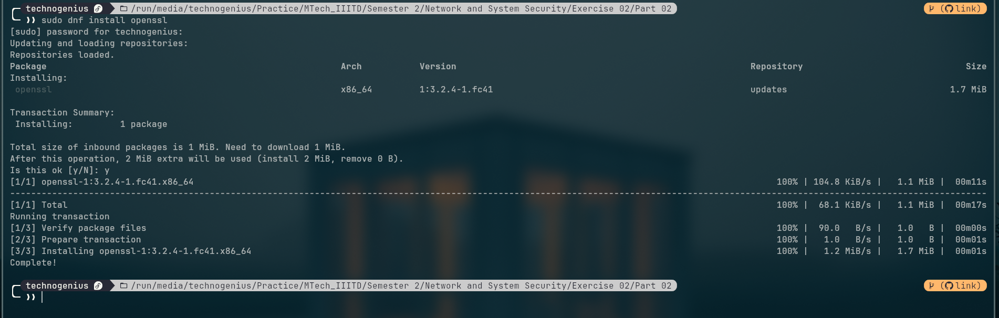 

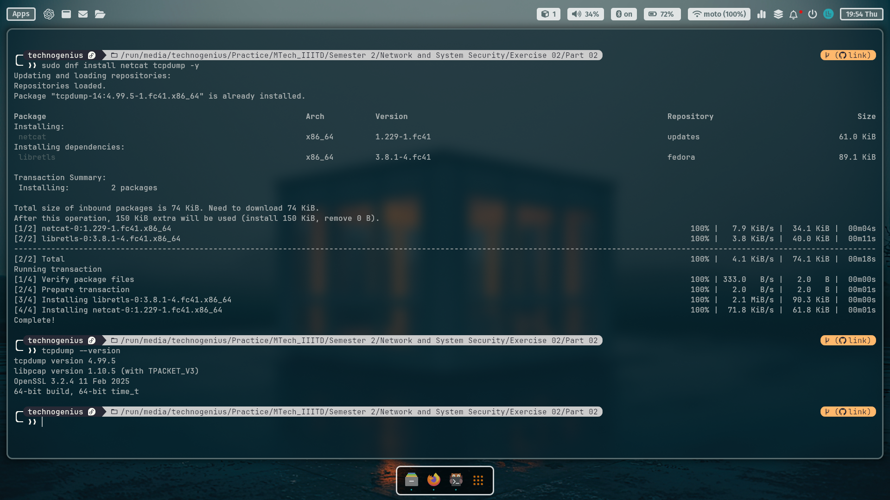
---

### **1. Advanced Explanation of Commands**

#### **a. `aesClient.sh`**

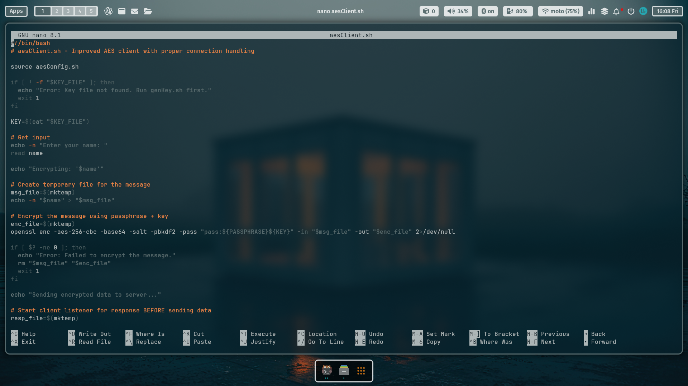 

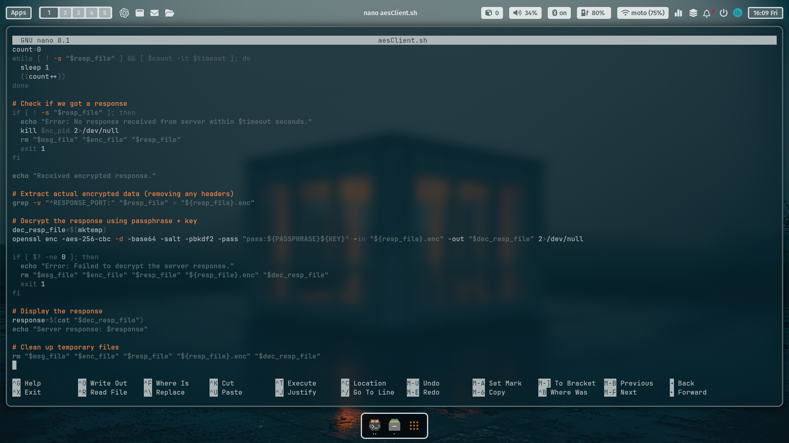

This script is the client-side program that sends an encrypted message to the server and waits for an encrypted response.

1. **`source aesConfig.sh`**
   - **Why**: This command loads the configuration file (`aesConfig.sh`) that contains variables like `SERVER_PORT`, `CLIENT_PORT`, `KEY_FILE`, etc.
   - **What it does**: It ensures the client knows which ports to use and where to find the encryption key.
   - **Advanced**: The `source` command is used to include the configuration file in the current script, making the variables available for use.

2. **`if [ ! -f "$KEY_FILE" ]; then ...`**
   - **Why**: This checks if the key file exists. If not, the script stops because encryption cannot happen without a key.
   - **What it does**: It ensures the key file is present before proceeding.
   - **Advanced**: The `-f` flag checks if the file exists and is a regular file. This is a common practice in shell scripting to validate file existence.

3. **`KEY=$(cat "$KEY_FILE")`**
   - **Why**: This reads the AES key from the key file.
   - **What it does**: The key is stored in the `KEY` variable for later use in encryption.
   - **Advanced**: The `cat` command reads the contents of the file and stores it in the `KEY` variable. This key is used in conjunction with the passphrase for encryption.

4. **`read name`**
   - **Why**: This takes user input (e.g., a name like "Bob") to send to the server.
   - **What it does**: The input is stored in the `name` variable.
   - **Advanced**: The `read` command is used to capture user input interactively. This is useful for dynamic data entry.

5. **`openssl enc -aes-256-cbc -base64 -salt -pbkdf2 -pass "pass:${PASSPHRASE}${KEY}" -in "$msg_file" -out "$enc_file"`**
   - **Why**: This encrypts the message using AES-256 encryption.
   - **What it does**: It takes the user's input (stored in `msg_file`), encrypts it using the passphrase and key, and saves the encrypted data in `enc_file`.
   - **Advanced**: 
     - `-aes-256-cbc`: Specifies the encryption algorithm (AES-256 in CBC mode).
     - `-base64`: Encodes the output in Base64 format for easy transmission.
     - `-salt`: Adds extra security by using a random salt.
     - `-pbkdf2`: Uses the PBKDF2 key derivation function for stronger key generation.
     - `-pass`: Combines the passphrase and key for encryption.

6. **`nc -l $CLIENT_PORT > "$resp_file" &`**
   - **Why**: This starts a netcat listener on the client's port to wait for the server's response.
   - **What it does**: It listens for incoming data on `CLIENT_PORT` and saves it to `resp_file`.
   - **Advanced**: The `&` at the end runs the command in the background, allowing the script to continue executing while waiting for the server's response.

7. **`(echo "RESPONSE_PORT:$CLIENT_PORT"; cat "$enc_file") | nc localhost $SERVER_PORT`**
   - **Why**: This sends the encrypted data to the server.
   - **What it does**: It sends the client's port number (for the server to respond) and the encrypted message to the server.
   - **Advanced**: The `|` (pipe) operator is used to send the output of one command as input to another. Here, it sends the port number and encrypted data to the server.

8. **`openssl enc -aes-256-cbc -d -base64 -salt -pbkdf2 -pass "pass:${PASSPHRASE}${KEY}" -in "${resp_file}.enc" -out "$dec_resp_file"`**
   - **Why**: This decrypts the server's response.
   - **What it does**: It takes the encrypted response from the server, decrypts it, and saves the result in `dec_resp_file`.
   - **Advanced**: The `-d` flag is used for decryption. The rest of the options are the same as for encryption.

9. **`rm "$msg_file" "$enc_file" "$resp_file" "${resp_file}.enc" "$dec_resp_file"`**
   - **Why**: This cleans up temporary files created during the process.
   - **What it does**: It deletes all temporary files to free up space.
   - **Advanced**: The `rm` command is used to remove files. This is important for security, as it ensures that sensitive data (like encrypted messages) is not left on the system.

---

#### **b. `aesServer.sh`**

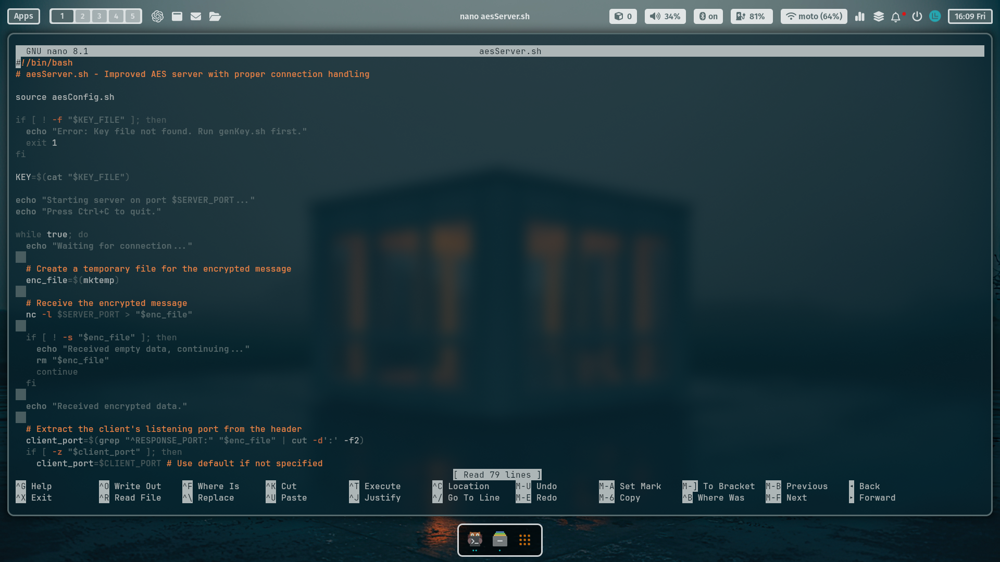 

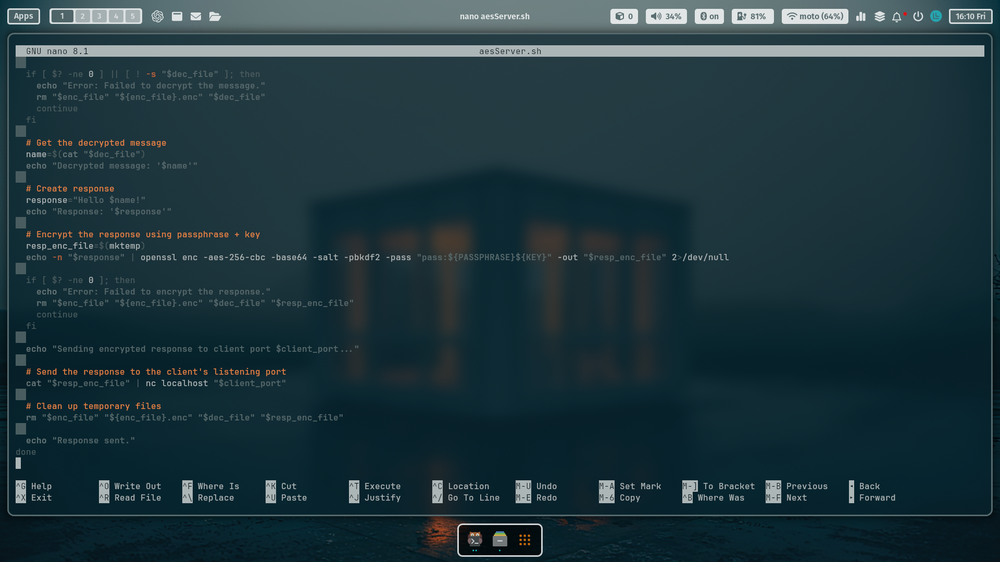

This script is the server-side program that listens for encrypted messages, decrypts them, and sends back an encrypted response.

1. **`source aesConfig.sh`**
   - **Why**: This loads the configuration file (`aesConfig.sh`) to get variables like `SERVER_PORT`, `KEY_FILE`, etc.
   - **What it does**: It ensures the server knows which port to listen on and where to find the encryption key.
   - **Advanced**: The `source` command is used to include the configuration file in the current script, making the variables available for use.

2. **`KEY=$(cat "$KEY_FILE")`**
   - **Why**: This reads the AES key from the key file.
   - **What it does**: The key is stored in the `KEY` variable for later use in decryption.
   - **Advanced**: The `cat` command reads the contents of the file and stores it in the `KEY` variable. This key is used in conjunction with the passphrase for decryption.

3. **`nc -l $SERVER_PORT > "$enc_file"`**
   - **Why**: This listens for incoming connections from the client.
   - **What it does**: It receives encrypted data from the client and saves it to `enc_file`.
   - **Advanced**: The `nc` (netcat) command is used to listen for incoming connections on the specified port.

4. **`client_port=$(grep "^RESPONSE_PORT:" "$enc_file" | cut -d':' -f2)`**
   - **Why**: This extracts the client's port number from the received data.
   - **What it does**: It tells the server where to send the response.
   - **Advanced**: The `grep` command searches for the line containing `RESPONSE_PORT:`, and `cut` extracts the port number.

5. **`openssl enc -aes-256-cbc -d -base64 -salt -pbkdf2 -pass "pass:${PASSPHRASE}${KEY}" -in "${enc_file}.enc" -out "$dec_file"`**
   - **Why**: This decrypts the client's message.
   - **What it does**: It takes the encrypted data, decrypts it, and saves the result in `dec_file`.
   - **Advanced**: The `-d` flag is used for decryption. The rest of the options are the same as for encryption.

6. **`response="Hello $name!"`**
   - **Why**: This creates the server's response message.
   - **What it does**: It prepends "Hello" to the decrypted name (e.g., "Hello Bob!").
   - **Advanced**: This is a simple string concatenation, but it could be extended to include more complex logic.

7. **`openssl enc -aes-256-cbc -base64 -salt -pbkdf2 -pass "pass:${PASSPHRASE}${KEY}" -out "$resp_enc_file"`**
   - **Why**: This encrypts the server's response.
   - **What it does**: It encrypts the response message and saves it in `resp_enc_file`.
   - **Advanced**: The same encryption options are used as in the client script.

8. **`cat "$resp_enc_file" | nc localhost "$client_port"`**
   - **Why**: This sends the encrypted response back to the client.
   - **What it does**: It sends the encrypted data to the client's listening port.
   - **Advanced**: The `|` (pipe) operator is used to send the output of one command as input to another. Here, it sends the encrypted data to the client.

---

#### **c. `captureTraffic.sh`**

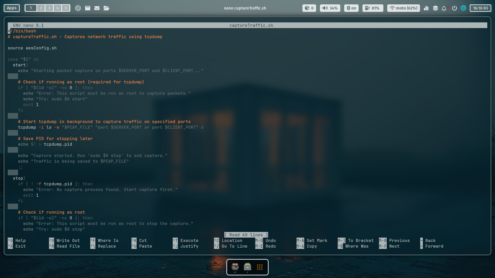 

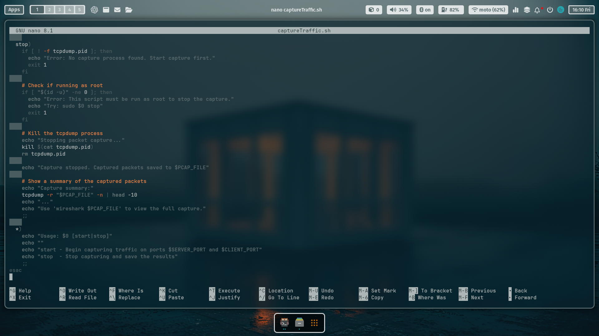

This script captures network traffic between the client and server using `tcpdump`.

1. **`tcpdump -i lo -w "$PCAP_FILE" "port $SERVER_PORT or port $CLIENT_PORT" &`**
   - **Why**: This starts capturing network traffic on the loopback interface (`lo`) for the specified ports.
   - **What it does**: It saves the captured traffic to `PCAP_FILE` for later analysis.
   - **Advanced**: The `-i lo` flag specifies the loopback interface, and `-w` writes the output to a file. The `&` runs the command in the background.

2. **`kill $(cat tcpdump.pid)`**
   - **Why**: This stops the `tcpdump` process.
   - **What it does**: It ends the packet capture and saves the results.
   - **Advanced**: The `kill` command terminates the process with the PID stored in `tcpdump.pid`.

---

#### **d. `genSecrets.sh`**

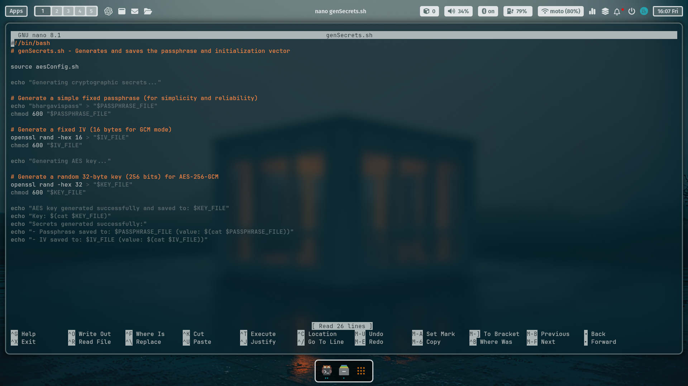

This script generates the passphrase, initialization vector (IV), and AES key.

1. **`echo "bhargavispass" > "$PASSPHRASE_FILE"`**
   - **Why**: This creates a fixed passphrase for encryption.
   - **What it does**: It saves the passphrase to `PASSPHRASE_FILE`.
   - **Advanced**: A fixed passphrase is used for simplicity, but in a real-world scenario, a more secure method (e.g., random generation) should be used.

2. **`openssl rand -hex 16 > "$IV_FILE"`**
   - **Why**: This generates a random 16-byte IV for AES encryption.
   - **What it does**: It saves the IV to `IV_FILE`.
   - **Advanced**: The `openssl rand` command generates cryptographically secure random data.

3. **`openssl rand -hex 32 > "$KEY_FILE"`**
   - **Why**: This generates a random 32-byte key for AES-256 encryption.
   - **What it does**: It saves the key to `KEY_FILE`.
   - **Advanced**: The key is 32 bytes (256 bits), which is the required size for AES-256 encryption.

---

### **2. Screenshots and Output Images**

#### **Screenshot 1: Running `genSecrets.sh`**
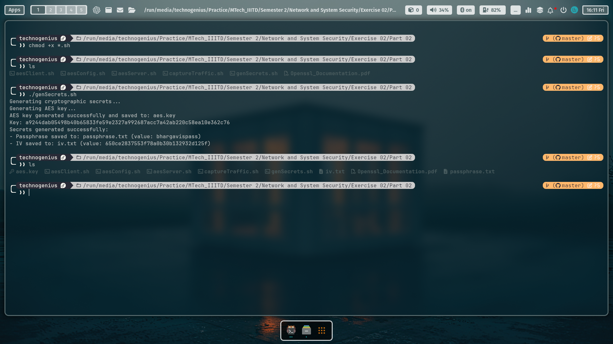
- **Description**: This screenshot shows the output of running `genSecrets.sh`. It generates the passphrase, IV, and AES key, and saves them to their respective files.

#### **Screenshot 2: Running `aesServer.sh`**
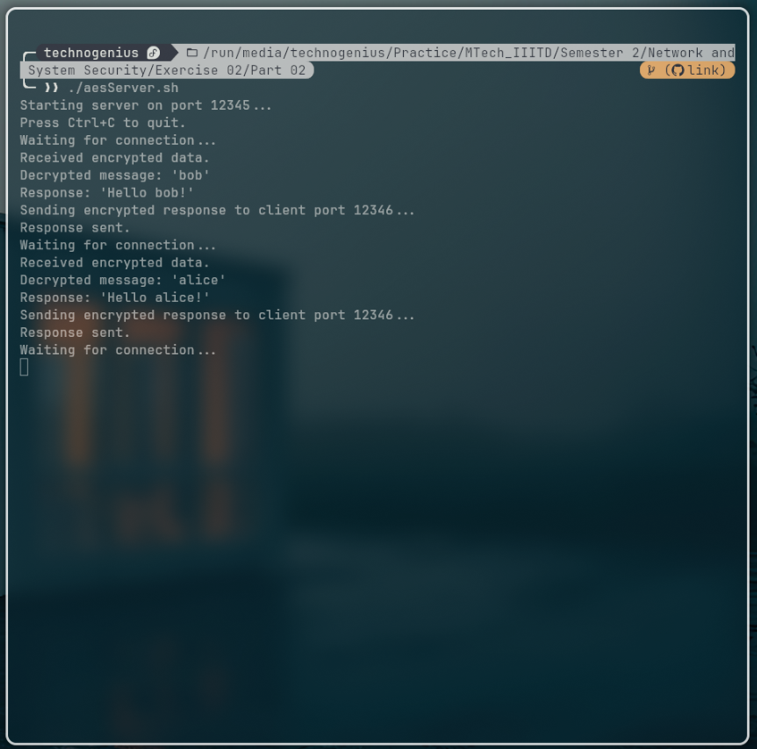
- **Description**: This screenshot shows the server starting and waiting for incoming connections on port `12345`.

#### **Screenshot 3: Running `aesClient.sh`**
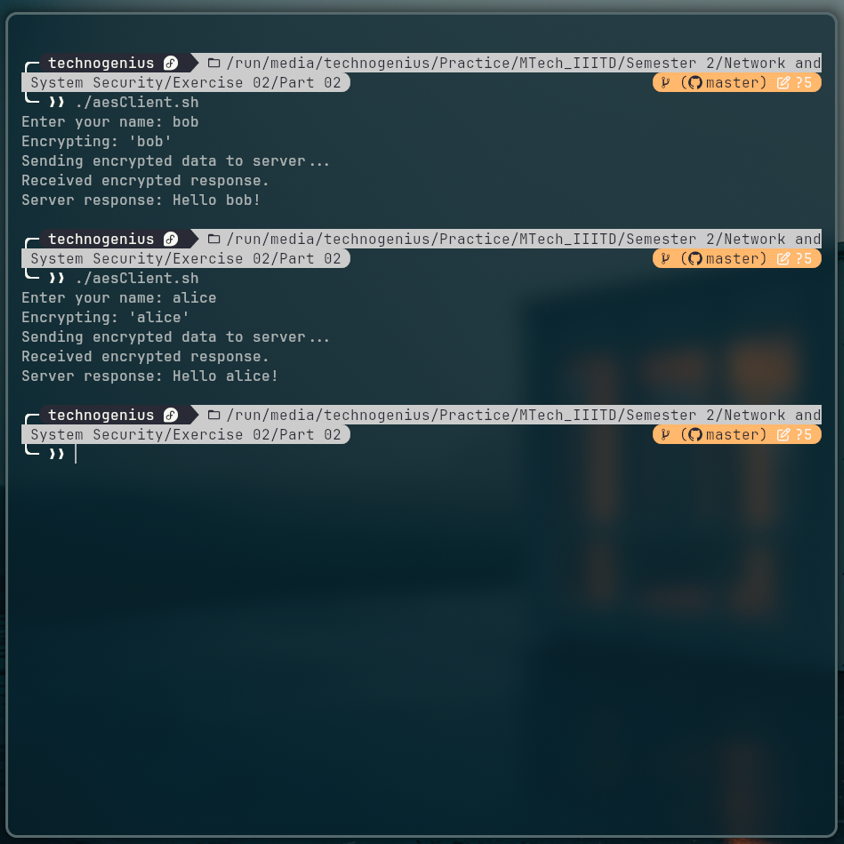
- **Description**: This screenshot shows the client sending an encrypted message to the server and receiving an encrypted response.

#### **Screenshot 4: Capturing Traffic with `captureTraffic.sh`**
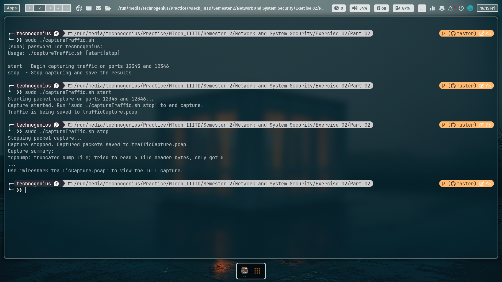
- **Description**: This screenshot shows the `tcpdump` process capturing traffic on ports `12345` and `12346`.

#### **Screenshot 5: Wireshark Encrypted Traffic**
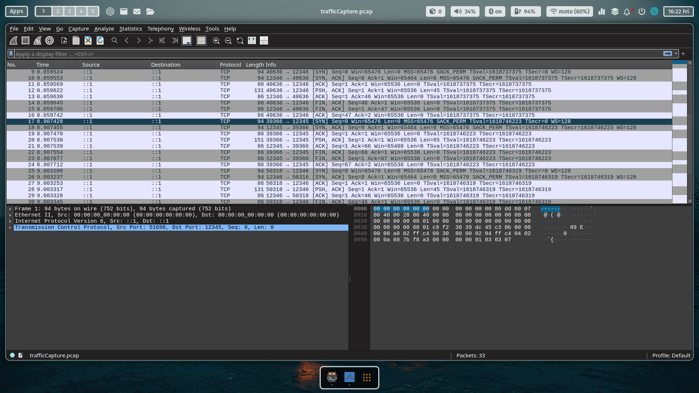
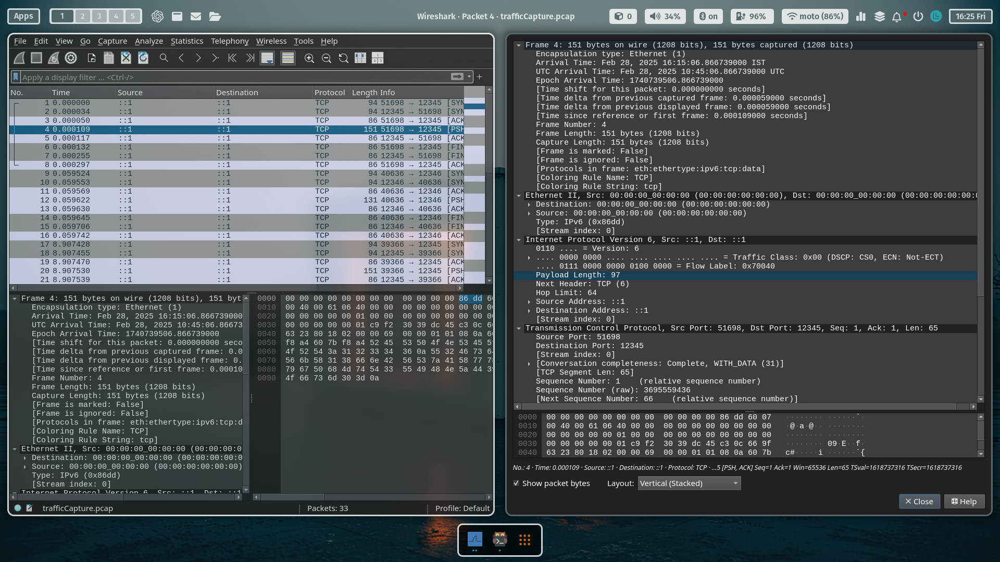

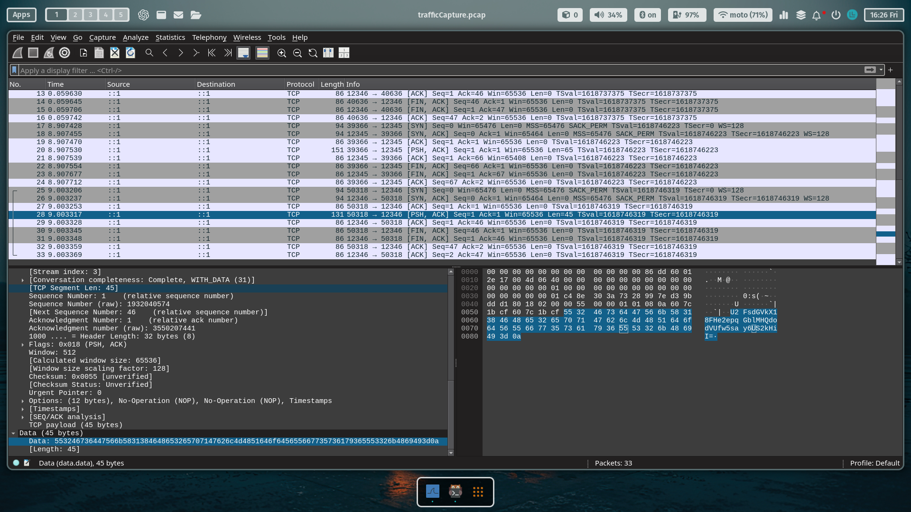
- **Description**: This screenshot shows the encrypted traffic in Wireshark. The data appears as random bytes, confirming that the communication is encrypted.

---

### **3. Encrypted Traffic in Wireshark**

- **Screenshot**: Wireshark showing encrypted traffic between the client and server on ports `12345` and `12346`.
- **Explanation**: The traffic is encrypted, so the data appears as random bytes. This confirms that the communication is secure.

---

### **Conclusion**

This exercise demonstrates how to use OpenSSL for AES encryption, netcat for communication, and `tcpdump` for traffic capture. The client and server exchange encrypted messages, and the traffic is confirmed to be encrypted using Wireshark. This setup is a basic example of secure communication using symmetric encryption, but it can be extended with more advanced features like key rotation, secure key exchange, and more.
